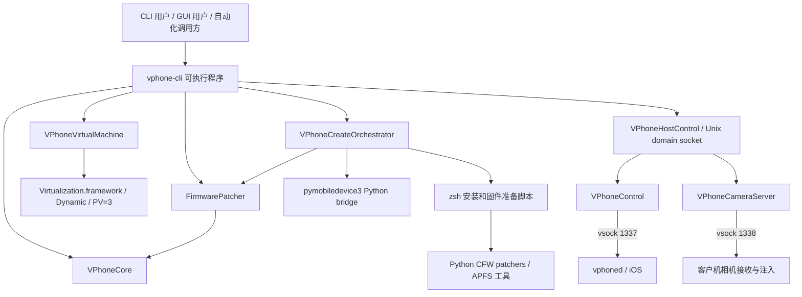

# vphone-cli 项目现状、架构解析与迭代建议

最新状态见 [2026-09-11 项目、分支、功能进展与待办](project_status_2026-09-11.md)。本文保留 2026-09-08 分析基线，历史问题是否仍存在须结合后续完成记录判断。

分析日期：2026-09-08。分析对象：本地分支 `codex/autophone-location-multivm-integration`，HEAD `4dcbdb8`，包含分析开始时已有的未提交修改。

后续更新：同日 A1 已完成测试环境恢复，新增统一入口并通过 222 项无固件测试。详见[测试基线执行记录](../research/test_baseline_2026-09-08.md)。本文原有测试阻塞描述保留为分析开始时的记录。

## 1. 核心判断

项目已经形成虚拟 iPhone 的创建、固件处理、恢复、运行、管理和自动化控制流程。当前实现同时覆盖三个方向：

1. 基于 Apple Virtualization.framework 私有 PV=3 能力的虚拟 iPhone 运行工具。
2. 组合 iPhone 用户态与 cloudOS/PCC 固件的补丁及部署工具。
3. 通过宿主机控制接口、定位和虚拟相机支持应用自动化的运行环境。

**建议先提高流程可恢复性、验证完整性和多 VM 操作一致性，再扩展自动化能力。EXP 应继续作为独立实验变体维护。** 该建议基于现有代码结构和已发现的约束，不代表已确定产品方向。

当前优势是固件适配知识积累、已有的端到端部署记录、可复用的 VM 管理模块，以及较完整的客户机控制能力。主要问题是文档与实现不一致、多个入口重复维护、补丁成功判定不完整，以及运行状态和自动化协议尚未统一。

## 2. 分析范围与证据强度

| 证据 | 本次覆盖范围 | 结论限制 |
| --- | --- | --- |
| 当前代码 | SwiftPM 配置、主要 CLI、VM 生命周期、VPhoneCore、固件流水线、控制协议、CFW 安装和构建发布流程 | 可确认实现及调用关系；不能替代运行验证 |
| 当前工作区 | Git 状态、近期提交、全部 6 个已修改文件的差异 | 未提交代码与 HEAD 分开说明 |
| 历史验证文档 | README 测试环境、补丁比较文档中的 2026-08-17 集成记录 | 属于历史记录，本次未重现 |
| 本次检查 | 3 项 Python 静态约束测试、3 个修改脚本的语法检查、差异格式检查、Swift 测试尝试 | 详细结果见第 9 节 |
| 未执行 | VM 启动、恢复、磁盘挂载、固件写入、相机与触控实测、Frida 客户端操作、性能基准 | 不给出这些操作的当前通过率或性能结论 |

本报告依据本地仓库快照。未刷新远端分支，也未核验外部软件的最新版本或兼容性。未逐一重新证明所有内核补丁的语义，未进行 vphone600 地址或符号解析。没有修改现有代码、应用新补丁或改变 VM 数据。

## 3. 代码规模与近期状态

### 3.1 工程结构

统计仅包含 Git 跟踪的相关源码，行数包含注释和空行；排除 vendor、资源子模块和 vphoned 的第三方头文件。行数不代表复杂度或质量。

| 模块 | 文件数 | 行数 | 主要职责 |
| --- | ---: | ---: | --- |
| `sources/vphone-cli` | 49 个 Swift 文件 | 10,785 | CLI、AppKit/SwiftUI、VM 运行、客户机控制和自动化 |
| `sources/VPhoneCore` | 18 个 Swift 文件 | 2,844 | VM 清单、库管理、文件操作、进程、网络、固件选择和系统定位 |
| `sources/FirmwarePatcher` | 70 个 Swift 文件 | 14,901 | ARM64、二进制容器、引导链、内核、DeviceTree 和文件系统补丁 |
| `scripts` | 92 个源码文件 | 24,432 | zsh 编排、Python CFW 补丁、Objective-C 客户机守护进程及相机注入 |
| `tests` | 27 个 Swift/Python/Shell 文件 | 3,516 | 核心模块、CLI 参数、指令编码、补丁比较、静态约束和固件矩阵 |

较大的实现文件包括：`VPhoneControl.swift` 1,243 行、`VPhoneHostControl.swift` 1,236 行、`DeviceTreePatcher.swift` 1,062 行、`CryptexFilesystemPatcher.swift` 1,028 行、`VPhoneCreateOrchestrator.swift` 630 行，以及 `libvcamcaptured.m` 4,822 行。建议按职责、状态所有权和测试接口拆分，避免仅根据行数拆文件。

来源：[Package.swift](../Package.swift)。

### 3.2 近期提交反映的工作方向

近期历史集中于 iOS 27 集成及语义匹配约束、持久系统定位、VPhoneCore 提取，以及构建产物和签名资源布局修正。例如：

| 提交 | 内容 |
| --- | --- |
| `4dcbdb8` | 将 signcert 放入脚本预期的资源目录 |
| `ec3eb43` | 将 vphoned 构建产物移出旧 VM 目录 |
| `bcb755a` | 使 `make build` 刷新应用包 |
| `6630ab9` | 将系统定位控制移入 VPhoneCore |
| `e53bdfa` | 增加持久系统定位流相关能力 |
| `60f9bbb` | 处理 iOS 27 beta 5 函数序言和补丁重复运行 |

这些提交说明开发已经涉及固件适配、运行时自动化和分发流程三个层面。提交历史不能独立证明所有路径均通过验证。

### 3.3 当前未提交修改

| 文件 | 修改内容 | 待验证事项 |
| --- | --- | --- |
| `cfw_install.sh`、`cfw_install_dev.sh`、`cfw_install_exp.sh` | 根据 `AEA1` 文件头判断是否需要解密；接受文件名仍为 `.aea`、内容已是 DMG 的输入 | 原始 AEA、已解密 DMG、已有缓存、无效输入、重复安装 |
| `VPhoneControl.swift` | 从仅旧 iOS 使用客户机触控，改为连接后只要声明 `touch` 能力就优先使用客户机触控 | 各 iOS 组合下的点击、拖动、长按和连接切换 |
| `VPhoneVirtualMachineView.swift`、`vphoned_hid.h` | 同步触控路径说明 | 原生 VZ 回退路径与客户机路径的行为一致性 |

修改总计 6 个文件、64 行新增、26 行删除。另有两个未跟踪的 `.ips` 诊断文件。本次未分析其内容，不能将它们与上述修改建立因果关系。

## 4. 实际架构

### 4.1 模块与依赖

`VPhoneCore` 已承担可复用的核心逻辑，但仍链接 Virtualization.framework。它不是独立的跨平台库。`FirmwarePatcher` 依赖 `VPhoneCore`；创建编排留在可执行目标中，当前代码说明这样可以避免形成包依赖环。

来源：[VPhoneCreateOrchestrator.swift](../sources/vphone-cli/VPhoneCreateOrchestrator.swift)、[VPhoneAppDelegate.swift](../sources/vphone-cli/VPhoneAppDelegate.swift)。

### 4.2 命令入口

根命令同时保留低层 `boot`、`patch-firmware`、`patch-component`，以及面向 VM 库的 `vm`、`fw`、`restore`、`cfw`、`setup` 命令。`boot` 是默认子命令。

`main.swift` 将启动操作交给 NSApplication 和 AppDelegate；其他命令直接执行。VM 创建逻辑已由 Swift 编排，但固件下载、部分恢复和 CFW 安装仍调用脚本或 Python。这是当前的多语言分工。

来源：[main.swift](../sources/vphone-cli/main.swift)、[VPhoneCLI.swift](../sources/vphone-cli/VPhoneCLI.swift)。

### 4.3 宿主机 VM 与 GUI

VM 模块负责硬件模型、CPU/内存、磁盘、NVRAM、SEP、显示、网络、vsock 和内核调试端口。AppDelegate 同时组织控制通道、菜单、文件/应用/钥匙串窗口、定位、相机、录屏和退出行为。

GUI 采用 AppKit 与 SwiftUI 混合结构。私有 API 通过 Dynamic 或 Objective-C runtime 访问。宿主机兼容性因此不仅取决于 Swift 编译是否成功，还取决于指定 macOS、私有 API、授权配置与固件组合的运行表现。

当前系统已有 `--headless`，但 `VPhoneHostControl` 的创建位于 `if !cli.noGraphics` 分支，且 `start()` 要求传入具体 VM 视图。**因此当前 headless 启动路径不会创建该宿主机控制 socket。** 定位和客户机连接仍可在 headless 分支启动。

来源：[VPhoneVirtualMachine.swift](../sources/vphone-cli/VPhoneVirtualMachine.swift)、[VPhoneAppDelegate.swift](../sources/vphone-cli/VPhoneAppDelegate.swift)、[VPhoneHostControl.swift](../sources/vphone-cli/VPhoneHostControl.swift)。

### 4.4 数据与状态

| 数据 | 当前位置或模型 | 作用与限制 |
| --- | --- | --- |
| VM 库 | 默认 `~/.vphone/VMs`；可通过 `VPHONE_LIBRARY_ROOT` 覆盖 | 按目录管理 VM |
| 硬件配置 | `config.plist` / `VPhoneVirtualMachineManifest` | 描述 CPU、内存、ROM、磁盘、屏幕、网络和身份 |
| 客户机状态 | `Disk.img`、NVRAM、SEPStorage、machineIdentifier | 生命周期操作需要考虑多个文件的一致性 |
| 启动身份 | `udid-prediction.txt`、SHSH 等 | 关联恢复目标和设备身份 |
| 本地控制接口 | 每个 VM 目录的 `vphone.sock` | 路径本身区分 VM；受 Unix socket 路径长度限制 |
| 系统定位 | 每个 VM 的 `system-location.json` | 当前持久化实现主要保存固定位置源；不能将提交标题理解为保存整个流历史 |
| 固件与工具缓存 | 主要位于 `~/.vphone`；旧 Make/test 路径仍使用仓库目录 | 新旧目录约定并存 |

VM 克隆优先使用 APFS CoW，失败后回退普通复制；随后清除 NVRAM、SHSH、预测身份并重置 machineIdentifier。**SEPStorage 保留原内容**，代码明确指出已恢复的 VM 克隆后可能需要重新恢复。不能把“重置部分身份”视为“得到完全独立的恢复状态”。

导入使用独立暂存目录，检查后再移入库；创建空 VM 失败会清理部分目录。这些是已有的恢复措施。完整 `vm create` 尚未提供贯穿所有阶段的持久检查点和续跑接口。

来源：[VPhoneBundleOps.swift](../sources/VPhoneCore/VPhoneBundleOps.swift)、[VPhoneLibrary.swift](../sources/VPhoneCore/VPhoneLibrary.swift)、[VPhoneSystemLocationController.swift](../sources/VPhoneCore/VPhoneSystemLocationController.swift)。

## 5. 固件与部署流程

### 5.1 主流程

上图描述常规非 `less` 流程。`less` 使用不同的文件系统和 Manifest 处理路径，并跳过创建编排中的宿主机 CFW 安装步骤。

`FirmwarePipeline` 当前建立 9 个描述项：AVPBooter、iBSS、iBEC、LLB、TXM、Kernel、DeviceTree、Filesystem、Manifest。后两个只在 `less` 配置实际补丁器。因此“处理 9 个项目”不表示所有变体都在 9 个项目中写入补丁。

### 5.2 五种变体

| 变体 | 当前设计用途 | 解析时应保留的区别 |
| --- | --- | --- |
| `less` | 减少引导链安全绕过，使用专用文件系统与 Manifest 流程 | README 的 “Patchless” 命名不等于没有任何镜像修改 |
| `regular` | 基础运行与 CFW 能力 | 不包含 JB/EXP 的全部扩展 |
| `dev` | 开发和调试相关扩展 | 使用 TXMDevPatcher；与 regular 不仅是命令别名关系 |
| `jb` | 越狱研究环境 | 增加 iBSS nonce、JB 内核扩展和客户机初始化 |
| `exp` | JB 基础上的 VM 身份、用户态与相机相关实验 | 应继续保留变体门控和独立验收 |

版本判断需要同时区分 **iPhone 用户态版本** 和 **cloudOS 内核版本**。例如 iOS 27 的兼容补丁由 iPhone 基础版本门控；Frida 的部分内核扩展还要求显式开关和 cloudOS 版本条件。不能只用一个 “iOS 版本” 字段描述完整兼容性。

来源：[FirmwarePipeline.swift](../sources/FirmwarePatcher/Pipeline/FirmwarePipeline.swift)、[KernelJBPatcher.swift](../sources/FirmwarePatcher/Kernel/KernelJBPatcher.swift)。

### 5.3 补丁实现与验证

Swift 固件层提供二进制容器、Mach-O 辅助、ARM64 解码与编码、符号/字符串/调用流匹配，以及 `PatchRecord`。记录包含补丁 ID、文件偏移、可选虚拟地址、前后字节、反汇编和说明，已经具备生成机器可读审计报告的基础。

Python 继续处理 CFW 和 DSC：包括 Mach-O 代码签名、缓存分块、修改页校验，以及按版本选择的用户态修正。引导链迁移到 Swift 不代表 Python 已退出项目。

需要精确描述编码机制：Python 使用 Keystone；Swift `ARM64Encoder` 中存在按指令格式计算编码的实现，固定常量在源码中声明为经 Keystone 生成并通过 Capstone 验证。不能将当前所有 Swift 替换指令都描述为运行时调用 Keystone。

当前重要缺口：`patchData()` 只在某个实际补丁器完全没有记录时抛错。单个内部补丁未命中，而其他补丁成功时，仍可能得到非空记录并写回文件。测试脚本专门通过搜索 `[-]` 日志弥补这一点，但日志文字不能稳定表达“预期跳过”和“必要补丁失败”。

另外，流水线逐项保存产物。后续项目失败时，先前项目已经写入；当前流程没有统一的事务提交和回滚。

来源：[PatchRecord.swift](../sources/FirmwarePatcher/Core/PatchRecord.swift)、[ARM64Encoder.swift](../sources/FirmwarePatcher/ARM64/ARM64Encoder.swift)、[ARM64Constants.swift](../sources/FirmwarePatcher/ARM64/ARM64Constants.swift)、[test_firmware_patches.sh](../tests/test_firmware_patches.sh)。

## 6. 运行时能力与自动化

| 能力 | 当前实现 | 验证或架构限制 |
| --- | --- | --- |
| VM 管理 | 创建、配置、列举、信息、启动、停止、重命名、删除、克隆、导入导出 | 不等于已具备统一调度、资源配额和操作互斥 |
| 网络 | NAT、桥接、关闭网络；配置与启动共用校验 | `hostOnly` 显式拒绝；桥接依赖可用宿主机接口；MAC 当前由框架分配 |
| GUI | 触控、按键、文件、应用、钥匙串、录屏等 | 私有显示和输入 API 需要实测 |
| 客户机控制 | 能力协商、文件、IPA、应用、URL、剪贴板、设置、Shell 等 | 各能力取决于客户机声明和相应实现 |
| 系统定位 | 固定源、流、所有者、generation、序列、超时、暂停/恢复、重连重放 | 已提取 GuestAdapter 和 StateStore；还需完整 socket 集成验证 |
| 虚拟相机 | 测试图、视频、静态图；generation 和帧状态回执 | 依赖客户机相机注入；传输成功不等于应用识别成功 |
| 自动化 | 每条 JSON 请求返回结构化结果，部分命令附截图 | 当前依赖 GUI；缺少统一公开协议和完整契约测试 |

### 6.1 两种控制协议

- 宿主机接口：Unix domain socket，一行 JSON 请求、一行 JSON 响应，连接随后关闭；不同连接并发处理。
- 宿主机与客户机：vsock 1337，4 字节大端长度加 JSON，包含版本、类型和请求 ID，部分操作附带二进制数据。
- 相机：独立 vsock 1338，使用小端长度字段、JSON 头和 BGRA 帧数据。

`VPhoneControl` 已有串行写队列、断线代次检查、握手超时、请求超时、心跳以及大传输写入 watchdog。这些机制应保留，并通过连接中断、迟到响应和大传输测试验证，避免拆分模块时丢失已有行为。

### 6.2 具体限制

1. **请求大小不一致。** HostControl 提供 `file_put` 的 `data_b64`，但 `readLine()` 在累计数据达到 4,096 字节后停止继续读取；单次 read 可能使累计值越过该阈值，因此也不是严格的 4 KiB 上限。较大的内联文件请求无法可靠读取。`load` 文件路径方式可以避免大 JSON，但需要调用方知道这一实现约束。
2. **socket 接入行为尚未形成完整契约。** 创建代码中未显式设置 socket 权限或校验连接者身份；读取循环中未设置读超时，连接按全局队列任务处理。实际访问范围取决于目录权限与 umask，本次未验证跨用户访问。应明确同用户信任模型、权限、超时、并发和错误响应。
3. **相机回执注释与判定不一致。** `cameraTransportReceipt()` 注释要求 published/observed 帧索引匹配；实现检查 generation 相同且两个索引均大于零，没有检查两个索引相等。应先定义回执是表示“同一流已有数据”还是“指定帧已消费”，再选择判定条件。
4. **相机数据量需要测量。** 以代码默认的 1280×720、BGRA、30 FPS 计算，原始像素量约为 105.5 MiB/s，未计协议与复制开销。这是理论输入量，不是已测得吞吐或 CPU 占用。后续优化应基于丢帧、延迟和内存复制数据。

来源：[VPhoneControl.swift](../sources/vphone-cli/VPhoneControl.swift)、[vphoned_protocol.m](../scripts/vphoned/vphoned_protocol.m)、[VPhoneHostControl.swift](../sources/vphone-cli/VPhoneHostControl.swift)、[VPhoneCameraServer.swift](../sources/vphone-cli/VPhoneCameraServer.swift)。

## 7. 构建、分发和依赖

当前有两个产物流程：

| 入口 | 实际产物 |
| --- | --- |
| `make build` → `bundle` | 编译和签名宿主机程序，刷新较精简的 `.app`；复制 ldid、签名资源和已有的 vphoned 产物 |
| `scripts/build.sh` | 构建宿主机与客户机，打包 scripts、patchers、资源、工具、requirements 等，再重新签名 |
| GitHub release workflow | 使用 `scripts/build.sh`，检查部分资源与 entitlement 后压缩并上传 |

因此，`make build` 成功不能单独证明生成了与发布流程等价的可移植应用包。建议让开发、CI 和发布共享一个实现，并显式区分精简构建与完整分发包。

顶层 Swift 依赖使用本地 vendor 子模块；本次 8 个子模块的 `git submodule status` 均未显示版本偏离。但 MachOKit 继续依赖远端 Swift 包，故当前工程不能仅凭初始化顶层子模块保证全新环境离线构建。仓库未跟踪根目录 `Package.resolved`。

Python requirements 大多没有固定版本；托管虚拟环境可在运行时创建或修复。这个设计方便首次使用，但增加了不同时间、不同机器解析出不同依赖组合的可能性。建议记录依赖解析结果和工具版本，而不是仅记录项目提交。

项目依赖专用宿主机配置、私有权限、固件来源和特定 SDK。产品化时应将预检结果、资源完整性和已验证环境作为明确输入。不能从 `.app` 可分发推导为普通 macOS 环境可直接运行。

来源：[Makefile](../Makefile)、[build.sh](../scripts/build.sh)、[release.yml](../.github/workflows/release.yml)、[VPhoneResources.swift](../sources/VPhoneCore/VPhoneResources.swift)、[requirements.txt](../requirements.txt)。

## 8. 问题、影响与建议优先级

优先级是本报告的迭代建议，不表示这些问题都已在运行中触发。P0 表示建议在扩大使用范围前解决；P1 表示下一阶段重点；P2 表示后续扩展。

| 优先级 | 问题与证据 | 影响 | 建议 |
| --- | --- | --- | --- |
| P0 | 单项补丁缺失可能仍返回总体成功；测试依赖日志扫描 | 产物是否完整缺少稳定判据 | 引入 required/optional 门控和结构化 applied/already-applied/not-applicable/failed 状态 |
| P0 | 四个 CFW 安装脚本默认共用 `/private/tmp/cfwhost`；host 驱动的清理也写死该路径 | 多任务并行安装可能互相操作挂载目录；本次未实测 | 每任务独立挂载目录，或全局串行锁；清理仅作用于当前任务持有资源 |
| P0 | `vm stop` 依据打开 Disk.img 的全部 lsof PID 发信号；删除、重命名、克隆等入口没有统一运行锁 | 进程识别与磁盘操作互斥不足；在线克隆一致性无法保证 | 明确 VM 进程所有权与实例锁，修改磁盘前验证停机状态 |
| P1 | 完整创建缺少持久阶段状态；后期失败后目录仍在，而重跑同名 create 被拒绝 | 用户需要自行判断可重跑阶段 | 阶段记录、输入哈希、产物校验、resume 与可诊断失败状态 |
| P1 | 固件逐项原地写回，没有统一提交 | 失败后可能留下部分修改产物 | 暂存产物，完整验证后提交；明确重复运行与恢复策略 |
| P1 | HostControl 依赖 GUI，且单类承担协议、调度、截图和具体命令 | headless 自动化受限，协议难独立测试 | 分离传输、命令执行与可选画面接口，保留现有 GUI 适配 |
| P1 | HostControl 请求长度、连接超时、权限与相机回执存在具体约束 | 调用方难以确定输入限制和成功含义 | 版本化协议、统一错误码、容量上限、契约测试 |
| P1 | 仅发现 release 触发的 workflow，没有 push/PR 测试流程 | 变更提交时缺少自动测试反馈 | 无固件测试作为 PR 必跑项；固件和运行验证单独分层 |
| P1 | 两套构建流程和多处 CFW 重复逻辑 | 同一修复需要同步多个位置 | 单一构建实现；提取共同 CFW 步骤，变体保留显式差异 |
| P1 | 文档、测试矩阵和补丁计数缺少统一来源 | 无法可靠判断支持范围及期望产物 | 机器可读兼容性清单，自动生成文档表格和测试输入 |
| P2 | 相机注入实现较大，尚无本次性能数据 | 重构和优化方向缺少量化依据 | 先增加 generation、帧延迟、丢帧和资源占用观测，再决定优化 |

相关来源：[cfw_install_host.sh](../scripts/cfw_install_host.sh)、[cfw_install.sh](../scripts/cfw_install.sh)、[VPhoneVMLaunchCLI.swift](../sources/vphone-cli/VPhoneVMLaunchCLI.swift)、[VPhoneVMCLI.swift](../sources/vphone-cli/VPhoneVMCLI.swift)、[VPhoneVMTransferCLI.swift](../sources/vphone-cli/VPhoneVMTransferCLI.swift)。

### 8.1 文档不一致的具体证据

| 来源 | 固件变体/计数记载 |
| --- | --- |
| AGENTS.md | 4 种变体；引导链 52 / 66 / 127 / 141 |
| README.md | 5 种变体；less 4，regular/dev/jb/exp 为 42 / 53 / 113 / 141 |
| 补丁比较文档 Summary | regular/dev/jb/exp 引导链为 46 / 58 / 117 / 132 |
| 2026-08-17 实验记录 | 特定 iOS 27 + cloudOS 26.4、JB+Frida 组合产生 168 个 PatchRecord |

这些数字没有统一输入、选项和计数单位，不能互相替代，也不能据此判断当前某次运行缺了多少补丁。建议分别记录：补丁方法数、写入记录数、安装阶段数、必要补丁集合和预期跳过集合。

AGENTS.md 中的目录图还包含当前已不存在的 `VPhoneIPAInstaller.swift`、`VPhoneSigner.swift`、`VPhoneMenuType.swift` 等旧文件；实际已经增加 VPhoneCore、FirmwarePatcher、应用/钥匙串浏览器和自动化模块。相机研究摘要仍有“实际帧交付待完成”的历史说明，而当前已有宿主机与客户机实现；这只能确认文档需要按阶段标注，不能直接认定所有应用的相机功能已验证。

来源：[AGENTS.md](../AGENTS.md)、[README.md](../README.md)、[补丁比较文档](../research/0_binary_patch_comparison.md)。

## 9. 质量与验证现状

### 9.1 已有测试资产

- `VPhoneCoreTests`：覆盖库、bundle、资源路径、进程、恢复信息、网络、选择器、定位校验及定位状态控制。
- `VPhoneCLITests`：当前主要覆盖定位参数校验。
- `FirmwarePatcherTests`：指令常量、编码/解码往返、合成样本和基于外部固件样本的比较测试。
- Python：CFW 语义匹配、Dropbear plist 重写、部分新补丁的静态约束。
- Shell：JB 内核和完整固件流水线的多版本测试脚本。

静态约束测试针对 8 个指定 Swift patcher 和 3 个指定 Python patcher，不能推导为整个补丁库均已遵守所有约束。名为 `CreateOrchestratorTests` 的测试位于只依赖 VPhoneCore 的目标中；实际创建编排位于可执行目标，不能仅凭测试文件名视为已覆盖完整创建流程。

固件比较测试依赖 `ipsws/patch_refactor_input`。本次该目录不存在。完整固件测试脚本还使用仓库内 `ipsws` 布局，与新 CLI 的用户缓存目录存在差异；其测试输入也不等同于所有 iPhone 用户态 × cloudOS 内核 × 变体组合。

### 9.2 本次检查结果

| 检查 | 结果 | 解释 |
| --- | --- | --- |
| `python3 -B -m unittest discover -s tests -p test_kernel_patch_guardrails.py -v` | 3 项通过 | 当前指定文件的静态约束通过 |
| `test_dropbear_plist.py` | 导入阶段中止 | 当前 Python 3.14.4 缺少 `capstone`；未执行实际测试断言 |
| `test_cfw_patch_semantics.py` | 未执行 | 同样依赖缺失的 Capstone/Keystone 环境 |
| 三个修改过的 CFW 脚本分别执行 `zsh -n` | 通过 | 只证明 Shell 语法检查通过 |
| `git diff --check` | 通过 | 检查已有差异的空白格式 |
| Swift 测试，排除固件比较和 VerboseJBDebug | 依赖解析阶段中止 | 调整缓存目录后，远端依赖下载无法连接本地代理 `127.0.0.1:10808` |
| 完整构建、VM 启动与固件回归 | 未执行 | 本报告没有新增此类运行证据 |

仓库本地 `.venv` 和默认用户托管 `~/.vphone/venv/bin/python3` 在检查时不可用。Swift 测试最初还遇到默认 Clang 缓存目录不可写，已通过临时缓存路径绕过；最终阻塞在依赖下载。这里的结果是环境阻塞，不能认定为 Swift 源码编译失败。测试使用独立临时构建目录，未重建现有发布二进制。

### 9.3 历史运行证据

2026-08-17 的研究记录描述了 iPhone `27.0 / 24A5408d` 与 cloudOS `26.4 / 23E5207q` 的 JB+Frida 流程：168 条补丁记录，完成恢复、CFW、首次与第二次启动，DDI 自动挂载，以及 Sileo/Frida 安装和 Frida 端口连通。

该记录同时明确：未执行宿主机 Frida instrumentation 会话；以 headless 方式启动，未视觉验证 VZ 显示和交互输入；当时 Swift 193 项测试中 179 项通过，13 项受样本缺失影响，另 1 项涉及 `/private/var` 与 `/var` 路径别名比较。

**以上是历史文档中的实验结果，不是本次测试结果，也不能覆盖当前未提交触控修改。**

来源：[历史集成验证记录](../research/0_binary_patch_comparison.md)、[PatchComparisonTests.swift](../tests/FirmwareIntegrationTests/PatchComparisonTests.swift)、[test_kernel_patch_guardrails.py](../tests/test_kernel_patch_guardrails.py)。

## 10. 可选迭代方向

| 方向 | 适用目标 | 可复用资产 | 主要工作 | 建议顺序 |
| --- | --- | --- | --- | --- |
| A. 可复现的研究环境 | 固件/内核研究、漏洞复现、受控版本对比 | 补丁器、PatchRecord、研究文档、恢复流程 | 兼容性清单、输入哈希、补丁完整性、失败恢复和实验记录 | 优先 |
| B. 应用自动化运行平台 | 应用流程测试、定位/相机输入、多个 VM 的任务执行 | HostControl、vphoned、定位控制、相机和截图 | headless 控制、版本化协议、等待条件、任务取消、多 VM 锁和隔离 | A 的基础改进后推进 |
| C. 易用的本地开发工具 | 降低创建与维护 VM 的操作成本 | CLI、选择器、预检、bundle 导入导出、应用包 | 统一构建、环境诊断、资源校验、阶段进度和失败说明 | 与 A 部分并行 |
| D. EXP 兼容性实验 | VM 身份和用户态差异研究 | 独立变体、DT/DSC/相机补丁 | 为每项实验定义目标、作用范围、回归组合和撤销条件 | 独立维护 |

建议保留“可复现的研究环境”为基础能力，以自动化接口作为下一项主要扩展。当前没有证据支持立即重写为跨平台框架、全面迁移到单一语言，或建立复杂的云端调度系统。

## 11. 建议的迭代顺序与验收标准

### 迭代一：形成可信的当前基线

工作：分别验证并提交已有 AEA 与触控修改；统一文档中的模块图和计数含义；建立不依赖固件样本的必跑测试；统一完整应用包检查；处理 CFW 挂载目录隔离和 VM 操作互斥。

验收：

- 新环境能够通过文档命令准备测试依赖，缺失项给出明确错误。
- 所有无固件测试通过；固件测试缺少输入时独立报告，不混同逻辑失败。
- 构建检查覆盖最终实际资源路径，包括 `scripts/vphoned/signcert.p12` 和客户机产物。
- 两个 VM 安装任务可以被可靠串行化，或使用完全独立的挂载目录。
- 对运行中的 VM 进行删除、重命名、克隆等操作时，具有明确且一致的保护规则。

### 迭代二：补丁与创建过程可恢复

工作：定义兼容性清单与必要补丁集合；扩展补丁结果状态；引入暂存产物和阶段检查点；对共同 CFW 步骤建立单一实现。

建议每次实验至少保存：项目提交和工作区状态、宿主机/SDK 信息、两套固件的版本/构建号/哈希、变体、选项、补丁结果、阶段状态、启动及能力验收结果。

验收：

- 任一必要补丁未命中时停止后续产物交付；预期不适用项不计作失败。
- 支持区分原始输入、已修改输入和不匹配输入。
- 恢复或安装中断后，可检查现有产物并从合适阶段继续。
- 文档计数由相同实验清单和运行记录生成。

### 迭代三：稳定自动化协议

工作：将 HostControl 的传输、命令处理和截图拆开；允许无 GUI 的命令运行；定义协议版本、能力发现、错误码、最大消息、超时、取消和成功含义。

定位模块已有状态控制器和 GuestAdapter，可作为测试接口的现有参考。相机应明确“请求已接受”“客户机已收到”“应用已使用”之间的区别。应用侧结果需要单独验证，不应由帧传输回执推导。

验收：

- headless VM 可执行 ping/能力查询、Shell、文件、应用和定位命令。
- 无画面能力时，截图返回明确的能力错误。
- 超长/分片 JSON、大文件、迟到响应、断线重连和并发请求均有契约测试。
- 相机与定位 generation 切换不会将旧任务结果误归入新任务。
- 两个 VM 并行执行任务时，状态、路径、日志和控制结果可区分。

### 迭代四：扩展兼容性与性能

工作：建立精确组合的运行矩阵，加入显示/输入、DDI、Frida 客户端、定位、相机、长时间运行和重复启动检查；依据测量优化。

建议指标：创建耗时及失败阶段分布、恢复续跑成功率、必要补丁命中率、客户机连接时间、命令延迟分位数、定位恢复时间、相机端到端延迟/丢帧、VM 内存及磁盘实际占用。当前没有这些指标的基线数值，不建议预先承诺提升幅度。

## 12. 维护原则与后续决策

1. 保留 Swift 固件层与 Python CFW 层的现有职责，先减少重复实现和不明确状态。
2. 将固件版本与用户态版本分别建模；所有兼容性结论绑定具体组合和选项。
3. 内核改动继续遵守语义定位、集中编码和记录要求；应用新补丁时同步更新 `research/0_binary_patch_comparison.md`。
4. 将历史验证、当前验证和待验证假设分开，避免研究记录被理解为持续有效的通过承诺。
5. 若首要使用者是安全研究人员，先推进迭代一和二；若近期必须支持应用自动化，在迭代一完成后优先推进 headless 控制和协议契约。

产品方向仍需确定的事项是：主要使用者、最低必须支持的固件组合、单机并行 VM 数量，以及是否需要完整的无 GUI 流程。这些决策影响迭代二至四的排序，不影响当前基线、互斥和验证问题的处理。
